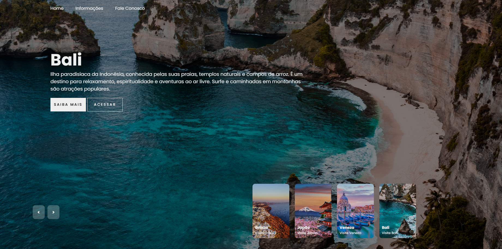

# 🌍 Country Slider

O Country Slider é uma ferramenta interativa que permite ao usuário explorar quatro países específicos, onde, ao clicar nas setas de navegação, ele descobre culturas, curiosidades e costumes exclusivos de cada um desses países.

## 📸 Demonstração

## ✨ Funcionalidades

- Transições suaves entre países com setas de navegação
- Informações culturais de cada país exibidas dinamicamente
- Design não responsivo 

## 🛠️ Tecnologias Utilizadas

- *HTML5* – Estruturação da página
- *CSS3* – Estilização e responsividade
- *JavaScript* – Manipulação do DOM e lógica de navegação

